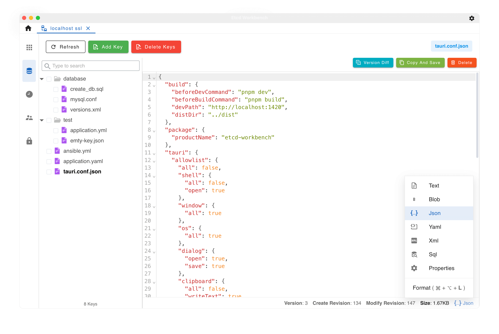
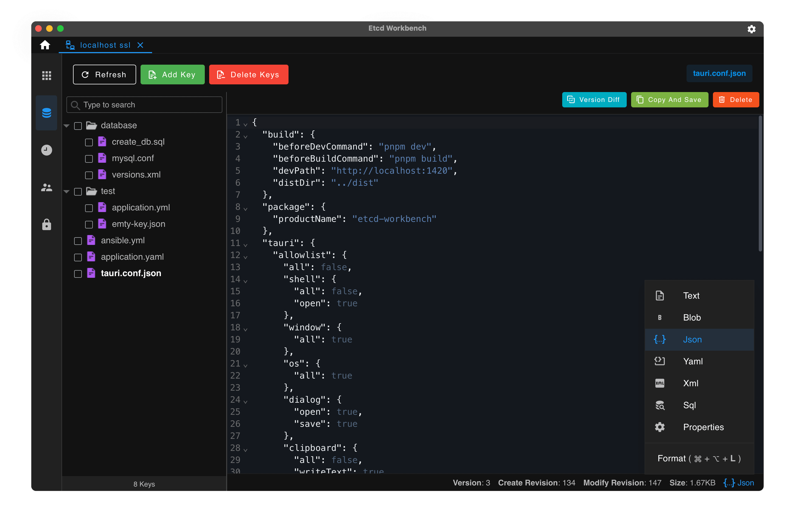
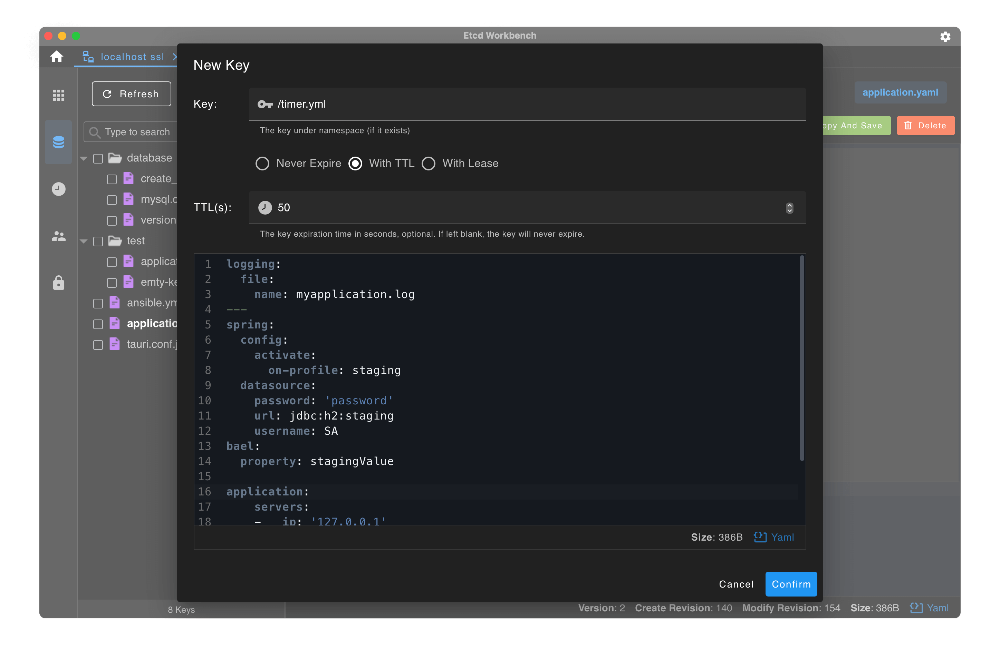
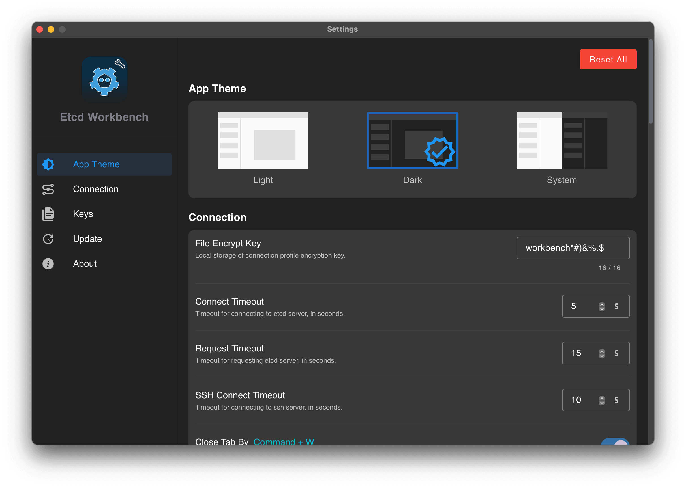
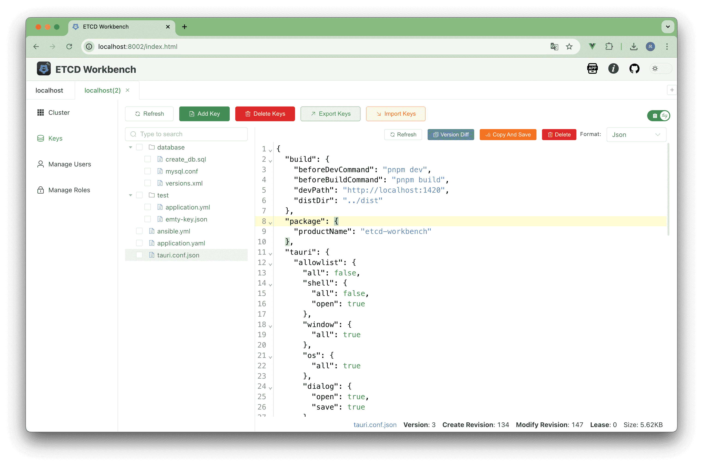
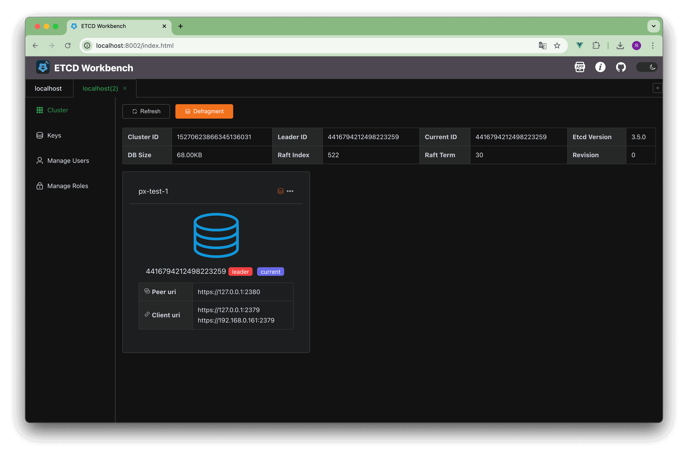

> Web版已标记为**归档**，并不再提供维护更新! [App版本](https://github.com/tzfun/etcd-workbench)会继续更新。

中文版 | [English](./README.md)

<div align=center>

</div>

<div align=center>

   

</div>

# Etcd Workbench

一个漂亮、轻量的 ETCD V3 客户端，提供 App 和 Web 版本，支持SSL、SSH Tunnel连接。

# 特点及功能

1. 本工具完全开源免费！
2. 提供 App 和 Web 两个版本，App直接下载安装到本地，Web版本可直接或使用 Docker 部署到服务器
3. 非常轻量，App 包体仅 **4M** ，Web包体仅 **15M**
4. 支持主题切换
5. 支持多连接管理
6. 支持 SSL、SSH 连接
7. 支持集群信息查看、版本压缩、数据备份等功能
8. 支持 Key-Value 编辑、多语言格式高亮、批量导入/导出
9. 支持 Key 多个版本内容比较
10. 支持 Lease 管理：创建、删除、Key绑定关系、倒计时显示
11. 支持用户管理：开关身份认证功能、用户创建、用户删除、用户授予/回收角色等
12. 支持角色管理：角色创建、角色删除、角色授权/回收权限等

- **App**: 拥有所有功能，相比Web版拥有更好的体验，数据方便迁移，后续将持续更新，推荐使用
- **Web**：拥有大部分功能，少部分功能不支持（例如数据备份等），用户无需下载可使用浏览器直接访问，支持多用户登录，**在未来某个版本将停更**！

# 下载

请前往[Etcd Workbench首页](https://tzfun.github.io/etcd-workbench/)下载最新版，如果需要下载历史版本请前往[releases](https://github.com/tzfun/etcd-workbench/releases)。

- App：版本号以 **App** 为前缀，例如 `App-1.0.0`
    - 支持 `windows-x86_64`
    - 支持 `macos-x86_64`
    - 支持 `macos-aarch64`
- Web：版本号以 **Web** 为前缀，例如 `Web-1.1.4`
    - 支持 Docker 平台：`linux/amd64`, `linux/arm64`, `windows/amd64`

> 注：在 2024年5月10日及之前的版本均是Web版，从 2024年8月30日发布的首个App版本开始使用此前缀规则。

# Web版使用文档

## 1. 快速体验

### 1.1 在线体验

访问 [http://etcd.beifengtz.com](http://etcd.beifengtz.com)

* 测试账号：test
* 测试密码：test

> **注意** 该测试客户端仅用作展示，请不要在其中保存真实的连接信息，保存的信息将会对所有登录test账号的人公开，
> Demo不会保留以及记录所有连接信息，但为避免你的连接信息泄露，请使用测试ETCD地址，或者使用私有化部署体验。

### 1.2 本地体验

首先需确保你的本地环境拥有 JDK 11及以上的版本，前往 [release](https://github.com/tzfun/etcd-workbench/releases) 下载最新的 jar 包后执行：

```shell
java -jar etcd-workbench.jar
```

浏览器中访问`http://localhost:8002`

## 2. 私有部署

### 2.1 配置文件

Web部署的配置很简单，仅需一个配置文件，并且配置内容也非常少，完整配置文件请查看 [etcd-workbench.conf](server/src/main/resources/etcd-workbench.conf)

### 2.2 本地部署

首先需确保你的本地环境拥有 **JDK 11+** 的版本，前往 [release](https://github.com/tzfun/etcd-workbench/releases) 下载最新的 Web版 jar 包，将配置文件 `etcd-workbench.conf` 放到和 jar 包同级目录即可生效，然后执行启动：

```shell
java -jar etcd-workbench.jar
```

浏览器中访问`http://localhost:8002`

### 2.3 Docker部署

Docker hub仓库地址：[https://hub.docker.com/r/tzfun/etcd-workbench](https://hub.docker.com/r/tzfun/etcd-workbench)

拉取Docker镜像

```shell
docker pull tzfun/etcd-workbench
```

启动容器

```shell
docker run \
    --name my-etcd-workbench \
    -p 8002:8002 \
    -v ./etcd-workbench.conf:/usr/tzfun/etcd-workbench/etcd-workbench.conf \
    -d \
    tzfun/etcd-workbench:latest
```

镜像的工作目录在 `/usr/tzfun/etcd-workbench`，其目录结构如下

```
/usr/tzfun/etcd-workbench # tree
├── bin
├── data
├── logs
├── temp
├── etcd-workbench.conf
└── etcd-workbench.jar
```

# 截图

## App部分页面截图










## Web部分页面截图






# 技术栈

## App

前端基于 Vue 开发，后端基于 Rust 开发，内存安全、低消耗、高性能

- **Tauri** - App Framework
- **Tokio** - 异步IO通信
- **etcd-client** - Etcd Connector
- **Vuetify** - UI框架


## Web

前端基于 Vue 开发，后端基于 Java 开发

- **[Jvmm](https://github.com/tzfun/jvmm)** - Server Framework
- **Netty** - 异步IO通信
- **jetcd** - Etcd Connector
- **element-plus** - UI框架


# License

[Apache License 2.0](LICENSE)